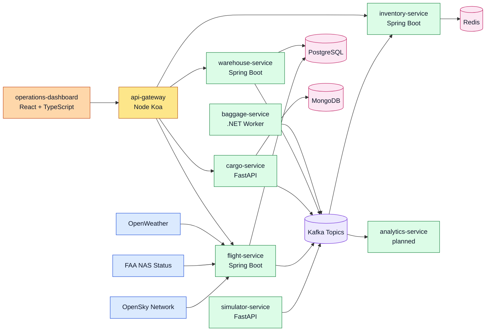
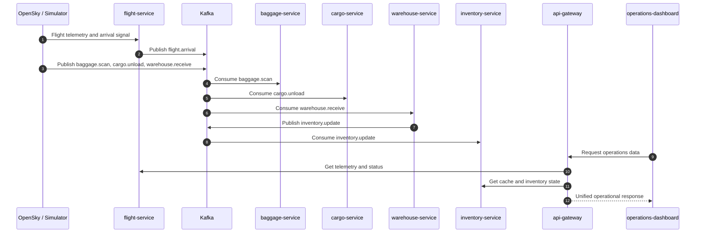

# AirOps360

<p align="center">
  <strong>Event-driven airport ground and warehouse operations platform</strong><br/>
  Modeling flight arrival, baggage scanning, cargo unloading, warehouse receiving, inventory updates, worker coordination, and operational analytics.
</p>

<p align="center">
  
  
  
  
  
</p>

## Why AirOps360 Matters

AirOps360 is designed to simulate the operational heartbeat of an airport ramp and warehouse ecosystem. Instead of treating flight telemetry, baggage scans, cargo unload activity, warehouse receiving, and inventory updates as isolated systems, it brings them together through an event backbone and a unified operations dashboard.

From a recruiter or engineering leadership perspective, this repo demonstrates:
- polyglot backend design across Spring Boot, .NET, FastAPI, and Node.js
- event-driven system thinking with Kafka topics and shared contracts
- operational platform maturity through Docker, Kubernetes, ArgoCD, Prometheus, Grafana, and GitHub Actions
- full-stack product thinking with a React dashboard layered over backend services and gateway APIs
- developer-experience work such as local environment setup, CI stabilization, BDD/E2E coverage, and architecture documentation

## Platform Snapshot

| Area | Current Direction |
| --- | --- |
| Domain | Airport ground operations + warehouse coordination |
| Architectural style | Event-driven microservices |
| Messaging backbone | Apache Kafka |
| Primary backend stacks | Java 17, .NET 8, Python FastAPI, Node.js Koa |
| Data layer | PostgreSQL, Redis, MongoDB |
| Frontend | React + TypeScript |
| Delivery platform | Docker, Kubernetes, ArgoCD, GitHub Actions |
| Observability | Prometheus + Grafana starter assets |
| Test surface | Java unit tests, Python pytest, NUnit + Moq, Playwright, Cucumber |

## Core Event Topics

- `flight.arrival`
- `baggage.scan`
- `cargo.unload`
- `warehouse.receive`
- `inventory.update`

## System Architecture



## Operational Event Flow



## Service Landscape

| Service | Stack | Role |
| --- | --- | --- |
| `flight-service` | Spring Boot | Fetches and normalizes flight telemetry from public sources |
| `baggage-service` | .NET Worker | Processes baggage scan events and worker-cycle logic |
| `cargo-service` | FastAPI | Models cargo unload intake workflows |
| `warehouse-service` | Spring Boot | Handles warehouse receiving workflows |
| `inventory-service` | Spring Boot | Maintains Redis-backed inventory cache behavior |
| `simulator-service` | FastAPI | Generates synthetic baggage, cargo, and warehouse events |
| `api-gateway` | Node.js Koa | Exposes a unified API surface for the dashboard |
| `operations-dashboard` | React + TypeScript | Presents flight, baggage, warehouse, cargo, and alert views |
| `worker-service` | Planned | Worker assignment and task orchestration |
| `analytics-service` | Planned | KPI aggregation and cross-service operational analytics |

## What Is Implemented Today

The repository currently contains:
- local Docker infrastructure for PostgreSQL, Redis, MongoDB, Kafka, and Kafka UI
- Kafka topic bootstrapping and shared JSON event schemas
- Spring Boot service skeletons for flight, warehouse, and inventory domains
- FastAPI skeletons for cargo and simulator domains
- a .NET baggage worker with NUnit + Moq test coverage
- a Koa API gateway with metrics and BDD coverage
- a React operations dashboard shell with flight, warehouse, and baggage-focused UI views
- Kubernetes base manifests, a development overlay, and ArgoCD application definitions
- Prometheus scrape configuration and Grafana starter dashboards
- GitHub Actions CI covering Java, Python, .NET, Node, Playwright, and Cucumber

## Engineering Highlights

- **Polyglot design:** the platform deliberately mixes the right runtime for the right job instead of forcing one language across every service.
- **Event-first modeling:** Kafka topics and schema docs shape the workflow boundaries before deeper persistence or orchestration logic.
- **Operational maturity:** the repo includes containerization, Kubernetes manifests, ArgoCD GitOps setup, metrics exposure, dashboards, and CI coverage.
- **Quality follow-through:** several post-build fixes hardened CI, test packaging, metrics routing, and documentation rendering until the pipeline was green.
- **Portfolio depth:** this is not just a UI demo or an API sample; it shows systems thinking across ingestion, processing, infrastructure, observability, and developer experience.

## Repository Layout

```text
AirOps360/
|-- services/
|   |-- flight-service/
|   |-- baggage-service/
|   |-- cargo-service/
|   |-- warehouse-service/
|   |-- inventory-service/
|   |-- worker-service/
|   |-- simulator-service/
|   |-- analytics-service/
|   `-- api-gateway/
|-- frontend/
|   `-- operations-dashboard/
|-- infrastructure/
|   |-- docker/
|   |-- kubernetes/
|   `-- argocd/
|-- tests/
`-- docs/
```

## Local Development And Testing

### Start shared infrastructure
```bash
cp .env.example .env
docker compose up -d
```

### Run core test surfaces
```bash
cd services/flight-service && mvn test
cd services/warehouse-service && mvn test
cd services/inventory-service && mvn test
cd services/cargo-service && python -m pip install -r requirements.txt && python -m pytest tests -q
cd services/simulator-service && python -m pip install -r requirements.txt && python -m pytest tests -q
cd services/baggage-service && dotnet test tests/BaggageService.Tests.csproj --configuration Release
cd services/api-gateway && npm install && node --check src/server.js
cd frontend/operations-dashboard && npm install && npm run build
```

### Run browser and BDD suites
```bash
cd frontend/operations-dashboard && npm install && npm run build
cd tests/e2e-playwright && npm install && npx playwright install --with-deps chromium && npm test
cd services/api-gateway && npm install
cd tests/bdd-cucumber && npm install && npm test
```

## Documentation Map

- `docs/architecture.md` for the detailed system context and event-flow diagrams
- `docs/local-development.md` for local setup and testing commands
- `docs/observability.md` for Prometheus and Grafana assets
- `docs/automated-tests.md` for CI and test coverage
- `docs/deployment/kubernetes-deployment.md` for Kubernetes deployment guidance
- `docs/repository-structure.md` for canonical repo organization

## Data Sources

AirOps360 is designed around free public or synthetic sources:
- OpenSky Network for flight telemetry
- FAA NAS Status for delay and disruption context
- OpenWeather for weather-driven operational impact
- simulator-service for synthetic baggage, cargo, and warehouse events

## Current Notes

- The repo still contains a few older exploratory folders outside the canonical AirOps360 layout.
- `worker-service` and `analytics-service` are documented as planned services and not yet implemented at the same depth as the active services.
- The strongest source of truth for the current platform shape is the combination of `services/`, `frontend/operations-dashboard/`, `infrastructure/`, and the documentation under `docs/`.
