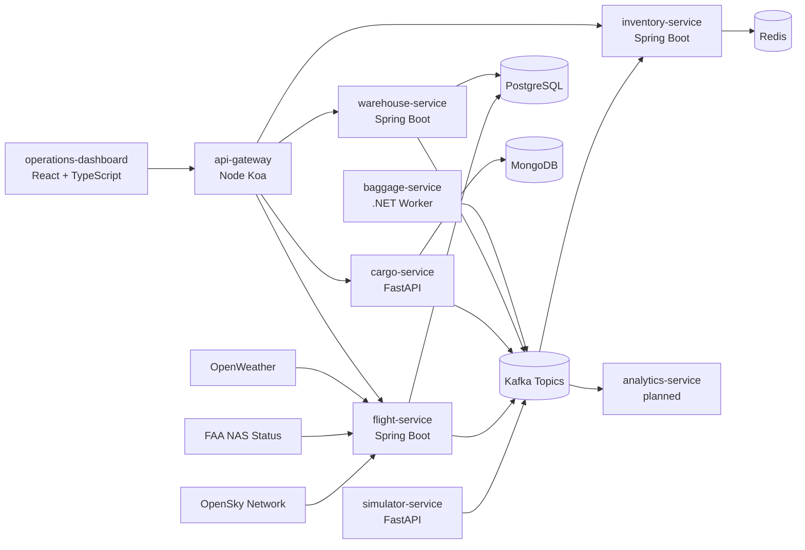
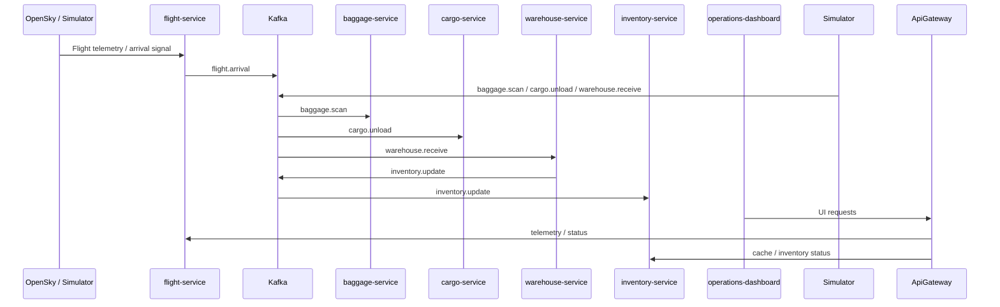

# Architecture

AirOps360 is organized as an event-driven airport ground and warehouse operations platform. The current repository contains service skeletons, shared event contracts, local infrastructure, Kubernetes deployment assets, and a dashboard shell that represent the target runtime shape.

## System Context

## Operational Event Flow

## Current Quality Notes
- The repo now has working CI coverage across Java, Python, .NET, Node, Playwright, and Cucumber.
- The canonical paths are under `services/`, `frontend/operations-dashboard/`, and `infrastructure/`.
- Some services such as `worker-service` and `analytics-service` are still placeholders and are documented as planned components rather than full implementations.
- The repo still contains a few older exploratory folders outside the canonical plan; the README and repository-structure docs identify which paths are authoritative.
